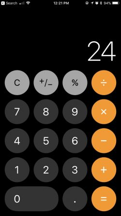

# Calculadora

La idea de este proyecto es aprender a usar y pensar aplicaciones javascript mientras hacemos una calculadora.

## Código

Trabajaremos en la carpeta workplace:
[link](./workplace)

## Contenido

El contenido de este proyecto esta organizado en los siguientes pasos

1. [Layout](./docs/00-layout.md)
2. [Estilos](./docs/01-estilos.md)
3. [Obtener Inputs](./docs/02-obtener-inputs.md)
4. [Funciones Básicas](./docs/03-funciones-basicas.md)
5. [Funciones Avanzadas](./docs/04-funciones-avanzadas.md)
6. [Modelando la calculadora en un objeto](./docs/05-objetos.md)
7. [Usando jquery para manejo del DOM](./docs/06-jquery.md)
